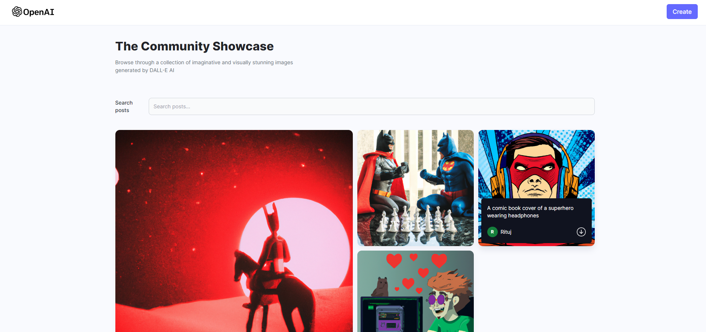
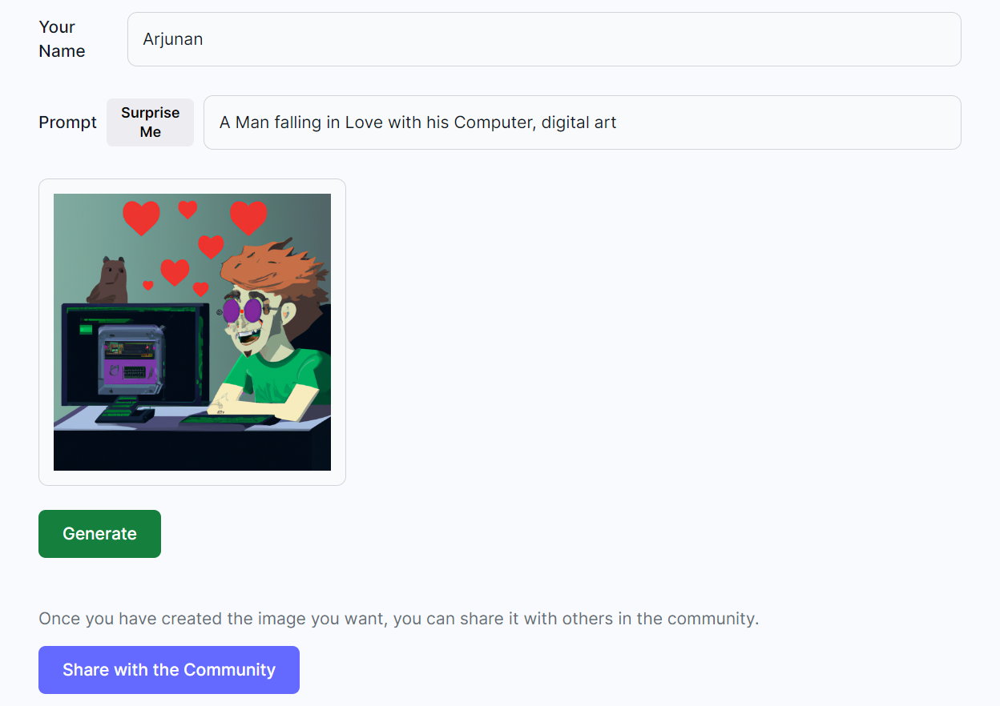

# <p align="center" id="top">Dall-E</p>
<p align="center" width="70px" height="70px"></p>

1. Clone this repo
2. `cd assets/client/`
3. Run `npm install`
4. Run `npm run build`
5. `cd assets/server/`
6. Run `npm install`
7. Create `.env` file in server folder
8. Add the env variables 

    ```env
    OPENAI_API_KEY=""

    MONGODB_URL=""

    CLOUDINARY_CLOUD_NAME=""

    CLOUDINARY_API_KEY=""

    CLOUDINARY_API_SECRET=""
    ```
You can grab the [Cloudinary API](https://cloudinary.com/), [Open-AI API](https://openai.com/) along with setting an [Atlas MongoDB](https://www.mongodb.com/atlas/database).





Made by Arjunan K

<a href="#top">Back to top</a>